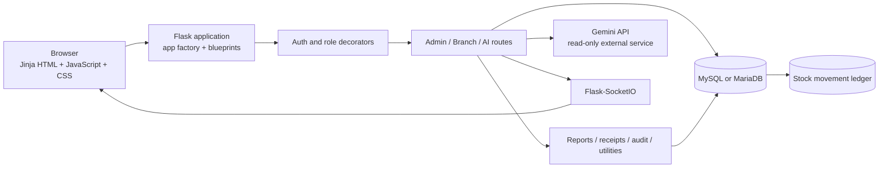
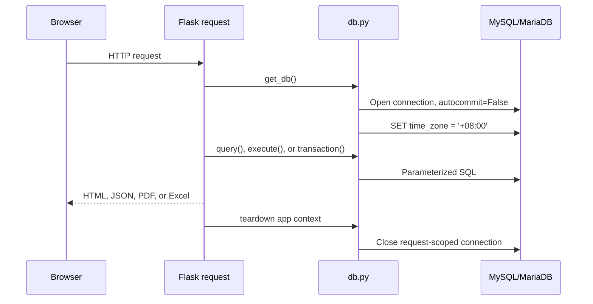
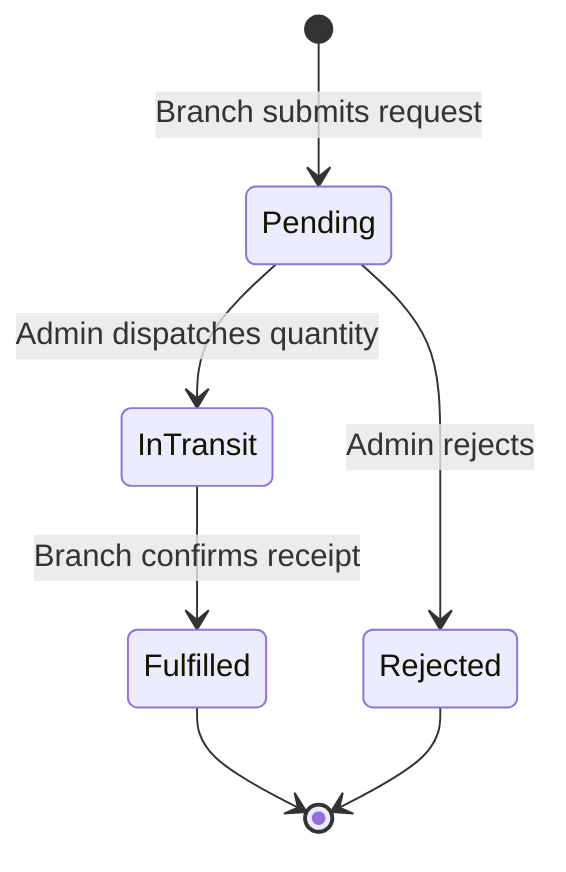
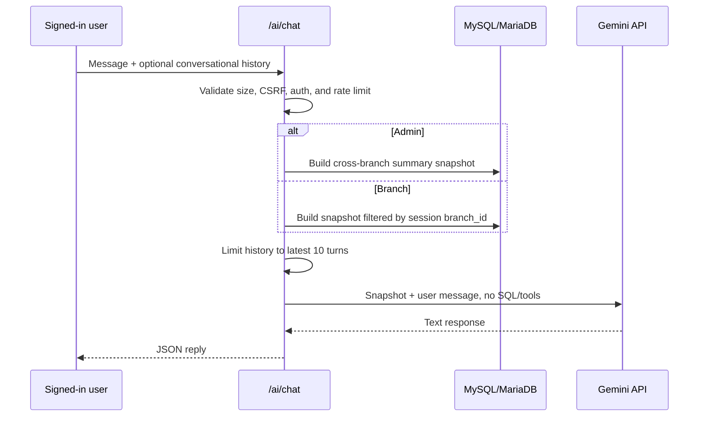

# Heaven & Angel Scents Inventory System
## System Architecture and Process Documentation

This document describes the implementation currently present in the repository. It is intended for developers, maintainers, operators, and reviewers who need to understand how a user action travels through the application and database.

## 1. System Purpose

Heaven & Angel Scents is a Flask web application for perfume manufacturing and retail inventory operations. It supports:

- HQ production and warehouse stock.
- Retail branch inventory.
- Branch stock requests and HQ dispatch.
- Branch receipt confirmation, damage reporting, and shortfall tracking.
- HQ and branch sales, including refills and salary deductions.
- Operational movement history and administrative audit events.
- Role-scoped dashboards, reports, PDF receipts, and Excel exports.
- A read-only AI assistant over a fresh, permission-scoped data snapshot.
- Realtime browser invalidation notifications through Socket.IO.

The application uses server-rendered Flask/Jinja pages backed by MySQL or MariaDB. JavaScript enhances navigation, notifications, filtering, charts, and background refreshes; it is not the authority for authorization or inventory correctness.

## 2. Architecture At A Glance



### Main layers

| Layer | Implementation | Responsibility |
| --- | --- | --- |
| Process entry | `app.py`, `wsgi.py` | Build the Flask app and start it locally or expose it to a production server. |
| Configuration | `config.py`, `.env` | Environment selection, database credentials, security settings, AI settings, and rate limits. |
| Extensions | `extensions.py` | Flask-Limiter and Flask-SocketIO initialization. |
| Web/API boundary | `routes/auth.py`, `routes/admin.py`, `routes/branch.py`, `routes/ai.py` | Validate requests, enforce roles, query data, execute workflows, and render responses. |
| Access control | `decorators.py` | Session presence, live account status, role checks, and forced-password handling. |
| Persistence | `db.py`, `schema.sql` | Request-scoped MySQL connections, parameterized queries, transactions, and schema. |
| Business support | `utils.py`, `audit.py`, `reports.py`, `receipts.py` | Input parsing, audit events, report construction, and PDF generation. |
| Realtime | `sockets.py`, `static/js/main.js` | Authenticated room membership and scope-based browser refresh signals. |
| Presentation | `templates/`, `static/css/style.css`, `static/js/` | Shared shell, role-specific pages, responsive styling, charts, and interaction behavior. |

## 3. Application Startup

### Development startup

1. `py app.py` imports `app.py`.
2. `create_app()` creates the Flask application.
3. The environment is read from `APP_ENV`; supported values are `development` and `production`.
4. Configuration is loaded from `Config` or `ProductionConfig`.
5. The app rejects non-debug startup when `SECRET_KEY` is missing or still equals the insecure development fallback.
6. Database teardown, CSRF protection, rate limiting, Socket.IO, and Talisman are initialized.
7. Auth, admin, branch, and AI blueprints are registered.
8. `audit.ensure_table()` verifies that `admin_actions` exists and creates a fallback table if necessary.
9. Error handlers, the `peso` template filter, and sidebar task-count context processor are registered.
10. `socketio.run()` starts the local server on port 5000.

### Production startup

`wsgi.py` exposes `app` for Gunicorn or another WSGI server. Because the application supports Socket.IO connections, the recommended server uses the gevent WebSocket worker:

```powershell
gunicorn -k geventwebsocket.gunicorn.workers.GeventWebSocketWorker -w 1 wsgi:app
```

Production configuration forces `DEBUG=False`, secure session cookies, HTTPS URL preference, and HSTS through Talisman.

### Request database lifecycle



`db.query()` is for reads. `db.execute()` commits a single write by default. `db.transaction()` commits all writes when its block exits successfully and rolls back the entire block if an exception escapes.

## 4. Authentication And Authorization

### Login process

1. The user opens `/login` and selects `Admin` or `Branch`.
2. The POST handler validates username and password presence and basic length limits.
3. The user is fetched by username and the password is checked with Werkzeug's password hash functions.
4. The selected login type must match the stored role.
5. Inactive users are rejected.
6. The session is cleared and replaced with the authenticated user ID, username, role, branch ID, branch name, and forced-password state.
7. The user is redirected to the role dashboard, or to `/change-password` when `must_change_password` is true.

### Protected request process

Every protected request re-reads the current account from `users`. This means deactivation and forced password changes take effect on the next protected HTTP request even if the browser still has an old signed session.

- `login_required`: authenticated users of any role.
- `admin_required`: authenticated users whose live role is `Admin`.
- `branch_required`: authenticated users whose live role is `Branch`.
- Inactive or missing accounts are signed out.
- Forced-password accounts can reach password change and logout, but not normal application pages.
- Branch data access is scoped using the server-side `session["branch_id"]`, never a branch ID supplied by the browser alone.

### Session and form protections

- Passwords are stored as Werkzeug hashes.
- Flask-WTF protects HTML state-changing forms with CSRF tokens.
- The AI JSON request sends the CSRF token in `X-CSRFToken`.
- Session cookies are HTTP-only and SameSite=Lax; production cookies are secure.
- `/logout` currently uses GET and clears the session. This has low impact but is still CSRF-triggerable and is a candidate for a future POST-only change.

## 5. Roles And Responsibilities

### Admin / HQ

Admins can see cross-branch operational data and can:

- View HQ and branch dashboards.
- Create or discontinue products.
- Record HQ production.
- Create branches.
- View branch stock.
- Create, deactivate, and reset user accounts.
- Review and process stock requests.
- Record direct HQ sales and refills.
- Review movement logs and administrative audit events.
- Generate admin reports and fulfilled-request receipts.

### Branch

Branch users are assigned to one retail branch and can:

- View their branch dashboard and inventory.
- Submit stock requests to HQ.
- Confirm shipments marked `In Transit`.
- Report received and damaged quantities.
- Download receipts for their own fulfilled requests.
- Record branch sales and refills.
- View their own sales history.
- Generate reports that are forcibly scoped to their branch.

## 6. Core Data Model

The authoritative schema is `schema.sql`.

| Table | Meaning | Important relationships |
| --- | --- | --- |
| `branches` | HQ and retail branch identities. | Referenced by users, inventory, requests, sales, movements. `branch_id=1` is the HQ warehouse in current routes. |
| `users` | Login identity, role, assignment, active state, and password-change flag. | Branch users reference `branches`; audit and movements retain actor references. |
| `products` | Product catalog keyed by SKU. | SKU includes the product base code and unit; products may be soft-discontinued. |
| `branch_inventory` | Current stock and reorder threshold for each branch/SKU. | Unique `(branch_id, sku)` row; HQ inventory is the row for branch 1. |
| `production_logs` | HQ production events and optional batch code. | References a product SKU. |
| `stock_requests` | Branch requisition and its dispatch/receipt state. | References branch and SKU; status is an enum. |
| `sales` | Sale/refill transaction with quantity, captured unit price, payment method, and optional employee name. | References branch, SKU, and legacy optional buyer user. |
| `stock_movement_logs` | Inventory ledger entry explaining a stock event, actor, reference, and optional before/after quantities. | References branch, SKU, and optional user. |
| `admin_actions` | Non-inventory administrative audit events. | Retains actor username alongside nullable actor ID. |

### Important invariants

- There is one inventory row per branch and SKU.
- Product creation initializes zero-stock inventory rows for all existing branches atomically.
- Branch creation initializes zero-stock rows for all existing products atomically.
- Product discontinuation is a soft status change; historical operational rows remain.
- A sale stores the charged price on the sale row, preserving historical revenue when the catalog price changes.
- Stock-changing workflows write a corresponding movement ledger entry in the same transaction.
- Foreign keys preserve references, but several operational tables use `ON DELETE CASCADE`; deleting a branch or product would remove related operational history if deletion were ever exposed.

## 7. End-To-End Operational Processes

### 7.1 Product creation

1. Admin submits item name, variant, unit, base code, and non-negative price.
2. `parse_base_code()` and `build_sku()` validate and construct the unit-specific SKU.
3. A transaction inserts the product.
4. The transaction inserts a zero-stock `branch_inventory` row for every branch, including HQ.
5. Commit makes the catalog and inventory rows visible together.
6. Realtime scopes `products` and `inventory` are broadcast.
7. An `add_product` row is written to `admin_actions`.

Duplicate SKU or unit combinations are rejected without committing a partial product.

### 7.2 Production into HQ stock

1. Admin selects an active SKU, enters a positive quantity, and may enter a batch code.
2. A transaction inserts `production_logs`.
3. HQ inventory for branch 1 is inserted or incremented.
4. The resulting stock level is read back.
5. A `PRODUCTION` movement records the quantity, actor, production reference, and before/after stock.
6. Commit completes the production event.
7. Admin tabs receive `production`, `inventory`, and `movement_logs` invalidation scopes.

The batch code is retained for traceability, but current sales do not allocate or consume stock by batch.

### 7.3 Branch stock request

1. Branch staff select an active product and enter a positive requested quantity.
2. The server verifies that the SKU is active.
3. A `stock_requests` row is inserted with status `Pending`.
4. Admin and the requesting branch receive a `requests` notification.
5. No inventory changes at this point.

Request state machine:



### 7.4 HQ dispatch

1. Admin chooses a pending request and dispatch quantity.
2. The request row and HQ inventory row are locked with `FOR UPDATE` inside one transaction.
3. The server verifies the request is still pending and that HQ stock is sufficient.
4. HQ inventory is decreased by the dispatched quantity.
5. The request is updated to `In Transit` with `dispatched_qty`.
6. A negative `DISPATCH` movement is written against HQ inventory, referencing the stock request.
7. Commit makes the request and stock reduction atomic.
8. Admin and the target branch receive `requests`, `inventory`, and `movement_logs` scopes.

A concurrent dispatch cannot process the same pending request or spend the same locked HQ stock row twice.

### 7.5 Branch receipt confirmation

1. Branch staff select an `In Transit` request.
2. The request is locked with `FOR UPDATE` and checked against the signed-in branch ID.
3. The server validates:

   `received_qty + damaged_qty <= dispatched_qty`

4. The request becomes `Fulfilled` and stores received and damaged quantities.
5. Received units are added to branch inventory.
6. A positive `RECEIPT` movement records before/after branch stock.
7. Damaged units produce a `DAMAGE` movement with explanatory notes and zero stock change.
8. Any unaccounted quantity produces an `ADJUSTMENT` movement flagged for HQ follow-up.
9. The transaction commits all request and ledger changes together.
10. A PDF receipt can subsequently be generated from the fulfilled request and its movement rows.

The receipt quantity calculation is:

`unaccounted = dispatched - received - damaged`

### 7.6 Branch or HQ sale

The branch and admin sale handlers follow the same inventory rules. The only difference is the stock owner: the signed-in branch for branch sales, or HQ branch 1 for admin sales.

1. The user selects a stocked active SKU, sale type, payment method, quantity, and charged unit price.
2. Quantity must be positive and price must be non-negative.
3. Salary Deduction requires a free-text employee name up to 120 characters.
4. The relevant inventory row is locked with `FOR UPDATE`.
5. Normal sales require enough stock and reduce inventory by `qty_sold`.
6. Refill transactions create revenue and a sales row but do not reduce `branch_inventory`; their ledger change is zero.
7. The sale stores the exact charged price, sale type, payment method, and buyer name.
8. A `SALE` or `REFILL` movement records the stock change, actor, and before/after quantities.
9. The transaction commits the sale, inventory change, and ledger entry together.
10. Admin/branch tabs receive relevant `inventory`, `sales`, and `movement_logs` scopes.

Revenue is calculated from the captured transaction value:

`revenue = SUM(qty_sold * unit_price)`

The legacy nullable `buyer_user_id` remains for historical compatibility, while current forms use `buyer_name` free text.

### 7.7 Product discontinuation

1. Admin posts to the product toggle endpoint.
2. `products.is_active` is inverted; the row is not deleted.
3. Active-only request and sale selectors stop offering it.
4. Branch inventory still shows a discontinued product while stock remains, preserving visibility of remaining units.
5. An administrative audit event and notification are produced.

### 7.8 User administration

Admin can create users, toggle active state, and reset passwords. New and reset accounts receive a forced password-change state. The implementation prevents an admin from deactivating their own account and prevents assigning a Branch account to HQ.

## 8. Reports And Documents

### Report registry

`reports.py` centralizes report definitions and builders. Available report types are:

- Product Catalog.
- HQ Production.
- Branch Stock / My Inventory.
- Stock Requests.
- Movement Ledger.
- Sales History.
- Employee Purchases (Salary Deduction).
- User Accounts.

Reports may support recent-row, date-range, or all-time modes plus type-specific filters. Inputs are normalized against fixed allow-lists, numeric values, or parsed dates. Dynamic SQL fragments are selected only from fixed internal values; data values are parameterized.

### Branch report isolation

Admin reports may select a branch. Branch reports receive `branch_scope` from the authenticated session. That server-side scope overrides query-string branch filters and removes cross-branch access.

### Output formats

- PDF is generated in memory with ReportLab.
- Bundled DejaVu fonts support the Philippine peso symbol.
- Excel is generated in memory with openpyxl.
- Excel output retains numeric/date values, formatting, filters, and frozen headers.
- Results are capped at 1,000 rows; capped output includes a note so truncation is visible.

### Goods-received receipt

`receipts.py` reads a fulfilled request and its `STOCK_REQUEST` movement entries, then formats them into a PDF. It does not recompute operational records from unrelated tables. Admin may retrieve any fulfilled request; branch users must match the request branch.

## 9. AI Assistant Process



The model is read-only. It receives a fresh snapshot for every request and has no database credentials, SQL capability, tool calling, or mutation endpoint. Branch snapshots contain only the signed-in branch's inventory, requests, and sales data. Messages are limited to 1,000 characters, history is limited to ten turns, and calls are rate-limited per signed-in user.

When `GEMINI_API_KEY` is absent, the endpoint returns a configuration response instead of calling the external service. The external call uses a 20-second timeout.

## 10. Realtime Updates And Frontend Behavior

Authenticated Socket.IO connections join:

- `admin` for Admin users.
- `branch:<branch_id>` for Branch users.

Write handlers emit coarse `data_changed` messages containing scope names such as `requests`, `inventory`, `sales`, `production`, `movement_logs`, `products`, `branches`, and `users`. They intentionally do not include business data. `static/js/main.js` maps scopes to the current page and refreshes affected content in the background, while deferring refreshes when the user is actively editing a form.

Human-readable notification-bell messages are a separate event. They are stored in browser local storage and are scoped by username in the frontend.

One operational caveat: Socket.IO connection authorization checks that a session exists, but does not re-query whether the account is still active. HTTP decorators will detect deactivation on the next protected request; an already-open realtime connection may remain until it disconnects or is otherwise closed.

## 11. Security And Integrity Controls

### Implemented controls

- Parameterized SQL through shared database helpers.
- CSRF protection for HTML forms and the AI JSON endpoint.
- Password hashing with Werkzeug.
- Live account-status checks on protected HTTP requests.
- Role checks and server-side branch scoping.
- Row locks for dispatch, receipt, and sale contention points.
- Atomic transactions for inventory-changing workflows.
- Movement ledger entries tied to actors and source references.
- Administrative audit entries for non-inventory admin actions.
- Production secret-key enforcement.
- Secure cookies, HTTPS enforcement, HSTS, and Talisman security headers in production.
- AI snapshot isolation and per-user rate limiting.
- Report filters constrained by fixed choices and parameterized values.

### Deployment considerations

- Default Flask-Limiter storage is process-local memory. Multi-worker deployment requires a shared backend such as Redis through `RATELIMIT_STORAGE_URI`.
- Socket.IO CORS defaults to wildcard when `SOCKETIO_CORS_ALLOWED_ORIGINS` is unset. Configure the real origins in production.
- The content security policy permits `unsafe-inline` scripts and styles because several templates currently contain inline blocks. A future hardening pass could use nonces or move those blocks into static files.
- Socket.IO and Google Fonts are external browser dependencies; availability and supply-chain policy should be considered.
- The application expects MySQL/MariaDB behavior and has no general migration framework. `schema.sql` contains an idempotent migration block and startup has only a defensive audit-table fallback.
- Temporary reset passwords are placed in Flask's signed client-side session for one-time display. Signing prevents tampering but does not encrypt the value.

## 12. Configuration And Operations

| Variable | Purpose |
| --- | --- |
| `APP_ENV` | `development` or `production`. |
| `FLASK_DEBUG` | Enables local Flask debug mode only when `1`. |
| `SECRET_KEY` | Session signing key; must be a real private value outside debug mode. |
| `MYSQL_HOST`, `MYSQL_PORT`, `MYSQL_USER`, `MYSQL_PASSWORD`, `MYSQL_DB` | MySQL/MariaDB connection settings. |
| `GEMINI_API_KEY` | Enables the AI assistant. |
| `GEMINI_MODEL` | Gemini model name; code default is `gemini-2.5-flash`. |
| `AI_CHAT_RATE_LIMIT` | Per-user AI limit, default `15 per minute;150 per day`. |
| `RATELIMIT_STORAGE_URI` | Shared limiter storage for multi-worker deployments. |
| `SOCKETIO_CORS_ALLOWED_ORIGINS` | Allowed Socket.IO origins. |

### Initial setup

1. Install Python 3.10 or newer.
2. Create and activate `.venv`.
3. Install `requirements.txt`.
4. Copy `.env.example` to `.env` and set database values.
5. Apply `schema.sql` to the configured database.
6. Run `py seed.py` in development to create starter accounts and temporary passwords.
7. Run `py app.py` and open `http://127.0.0.1:5000`.

`seed.py` refuses to run with `APP_ENV=production`.

## 13. Observability And Failure Behavior

- Route-level exceptions generally log a stack trace and return a user-facing flash message followed by a redirect.
- Audit logging is best effort: failure to write an admin audit row does not fail the administrative operation, but the logger records the failure.
- Database transaction failures roll back all writes in the transaction block.
- Missing AI configuration and external AI failures return JSON error messages with HTTP 502 from the AI endpoint.
- Global handlers render the shared error template for 403, 404, 429, and 500 responses.
- Sidebar task counts are calculated from live database queries for the current session role.

## 14. Known Gaps And Documentation Drift

These points are important when maintaining or extending the system:

1. The README still contains branch-price-override language and a branch-pricing route description, but the current schema, routes, and reports use `products.price` as the catalog/reference price and capture the actual charged price on each sale. The current code should be treated as authoritative until the README is reconciled.
2. Schema comments mention FIFO batch selling, but there is no batch allocation table or sale-to-production-batch relationship. `batch_code` is currently traceability metadata only.
3. The code default for `GEMINI_MODEL` is `gemini-2.5-flash`, while `.env.example` names a different model. Deployment configuration should choose one supported value explicitly.
4. `buyer_user_id` is legacy nullable data; current salary deductions use manually entered `buyer_name`, so payroll reconciliation is not referentially enforced.
5. No explicit general inventory-adjustment UI is present. Corrections must currently be represented by the workflows that create production, dispatch, receipt, sale, damage, or shortfall events.
6. There is no visible automated unit or integration test suite covering the main workflows. CI performs compilation, app-factory, schema, and database smoke checks but does not fully exercise authorization, concurrency, reports, receipts, AI, or Socket.IO behavior.
7. The database uses `+08:00` for connections and database date functions, while some filenames or labels use Python's local date. On a server outside the Philippines around midnight, labels can differ from database business dates.
8. Foreign-key cascade behavior could erase operational history if future administration features expose branch or product deletion. Soft status changes are safer for historical entities.

## 15. Recommended Maintenance Priorities

1. Reconcile README and schema comments with the implemented pricing and refill behavior.
2. Add focused tests for branch isolation, forced-password access, concurrent dispatch/sales, receipt quantity validation, report filters, and AI snapshot scope.
3. Configure Redis or another shared limiter store before running multiple workers.
4. Configure explicit Socket.IO allowed origins in production.
5. Convert logout to a CSRF-protected POST endpoint.
6. Reconcile all application and database date labels around the Asia/Manila business timezone.
7. Decide whether batch-level FIFO tracking is a real requirement; if it is, add batch inventory and sale allocation relationships rather than relying on `batch_code` alone.
8. Consider a durable migration tool if schema evolution becomes more frequent than the current idempotent SQL block can safely support.
